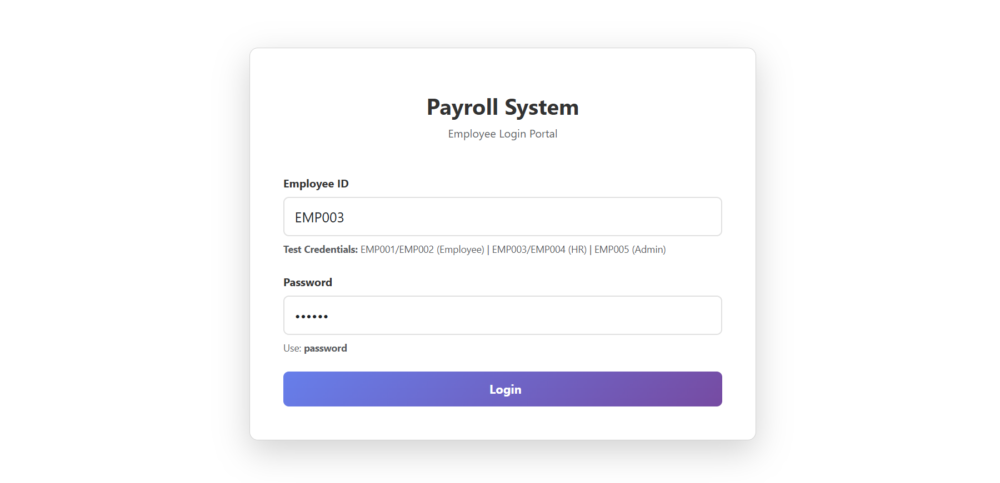
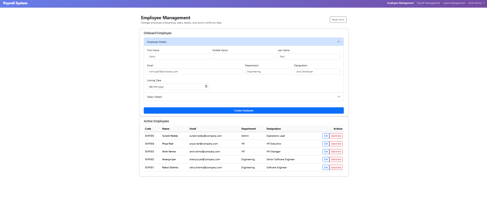
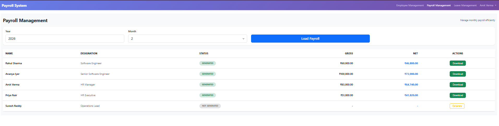
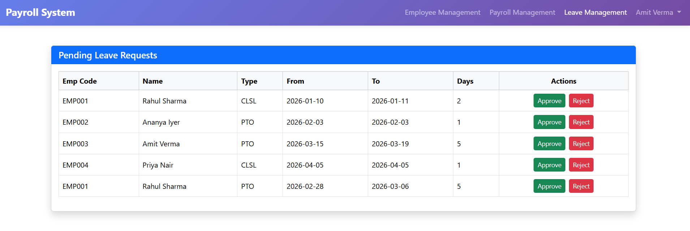
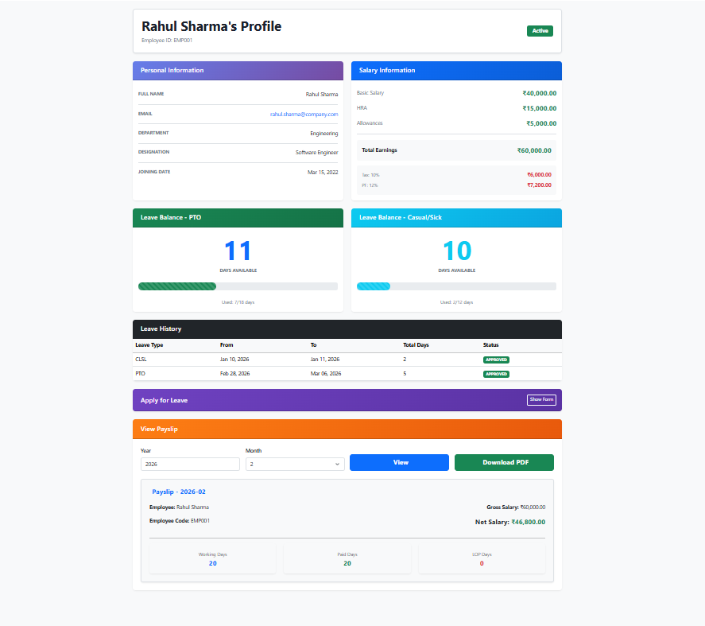
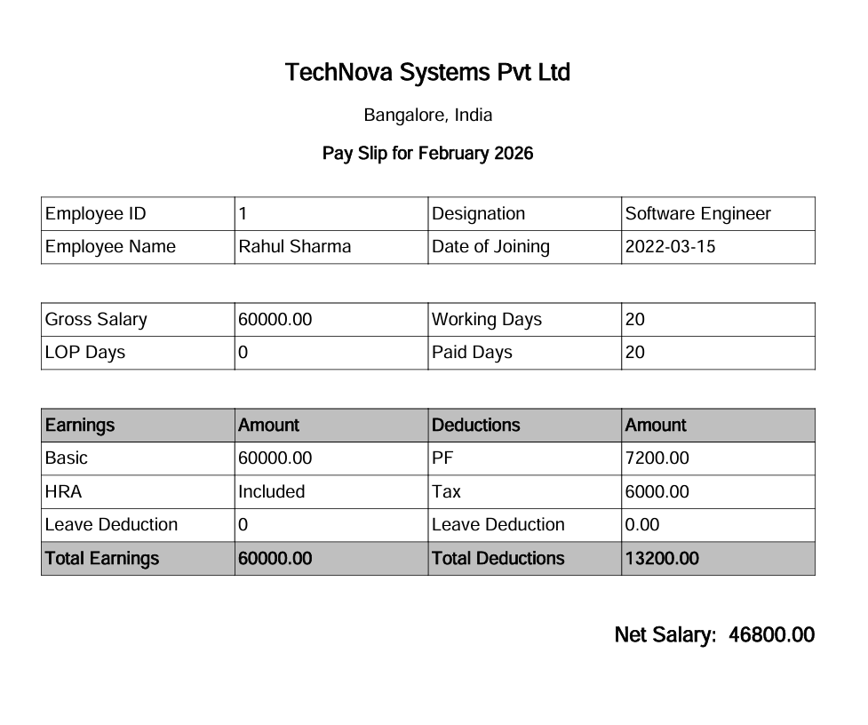

# 💼 Payroll Management System

A Full-Stack Payroll Management System built using:

- **Backend:** Spring Boot (Microservice-ready)
- **Frontend:** Angular + Bootstrap 5
- **Database:** H2
- **PDF Generation:** Payslip Download
- **Role-based Access:** HR & Employee Views

---

## 🚀 Features

### 👩‍💼 HR Module
- View payroll status of all employees by month
- Generate payroll if not already generated
- Download payslip PDF
- View gross/net salary
- Track payroll generation status

### 👨‍💻 Employee Module
- View personal payroll details
- Download payslip PDF
- View earnings and deductions breakdown
- Track working days / paid days / LOP days

---

## 🏗 Architecture

### Backend (Spring Boot)

- REST APIs
- Layered Architecture:
  - Controller
  - Service
  - Repository
  - DTO
  - Exception Handling
- Global Exception Handler
- PDF Generation Service
- Transactional Payroll Generation
- YearMonth-based Payroll Management

### Frontend (Angular)

- Reactive Forms
- Bootstrap 5 UI
- Scroll to preview feature
- Dynamic month/year filter
- Blob-based PDF download
- Component-based architecture 

---

## 🖼 Application Screens
### 🏠 Login Screen

### 🏠 Employee Dashboard

### 🏠 Payroll Dashboard

### 🧾 Leave Preview

### 👨‍💻 Employee Profile & Leave Section

### 📄 Payslip PDF

